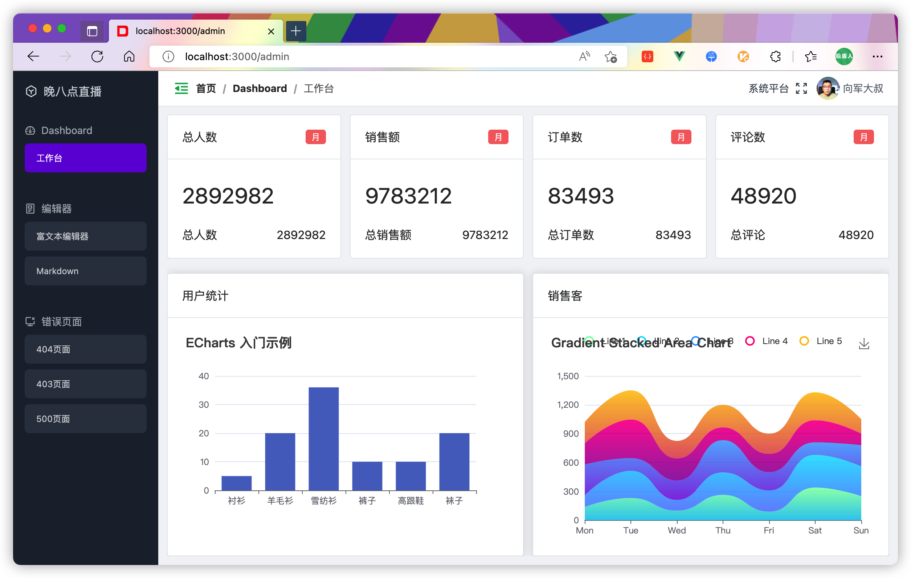
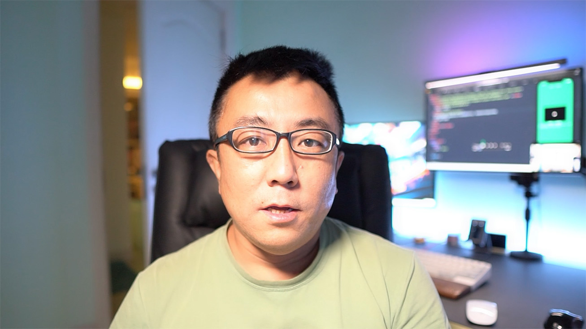
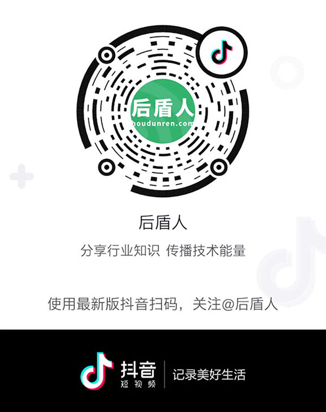

## 项目介绍

基于 Laravel+Vue 框架构建的支持多站点、多模块的SASS平台系统。

100% 免费使用于任何项目，包括企业商业用途。

> 希望大家为本项目加个 Star，这样我们会更有动力，谢谢你。

这是 hdcms 系统的 PHP 版本，我们也会提供其他编程语言的支持，请访问 [github](https://github.com/houdunwang/hdcms) 或 [gitee](https://gitee.com/houdunren/hdcms) 版本库了解。

### 产品特点

- 全新的产品设计、快速的产品创新、超出用户期待的产品价值，。
- 系统提供方便的二次开发机制，可根据自身业务需要快捷开发功能模块，并可将功能模块发布到应用商店进行二次获利。
- 完全免费使用的同时不定期发布版本更新，不断推出让使用者惊喜的新功能，新模块。企业或个人也可以用做成云服务，进行网站搭建与模块使用。

项目支持多模块、多站点的平台，下面对特点进行简单描述

- 多站点多模块
- 微信、支付宝支付
- 微信扫码登录
- 独立安装界面
- 使用 laravel+vue3 构建，社区完善

### 项目作者

开发者 [向军大叔](https://www.houdunren.com) 从事编程多年的老程序员，晚 8 点在抖音与 B 站直播，欢迎光临。

### 在线文档

我们提供了完善的帮助手册，便于开发者进行二次开发 [查看手册](https://doc.houdunren.com)，你也可以访问 [http://www.houdunren.com](http://www.houdunren.com/) 通过视频教程来学习使用。

## 安装方式

下面介绍两种安装方式

### 获取软件

**composer**

目前是测试版本，所以需要指定`:dev-master` 版本

```
composer create-project houdunwang/php:dev-master
```

**Git**

你也可以直接从 [github](https://github.com/houdunwang/php) 或 [gitee](https://gitee.com/houdunren/php) 下载项目

### 后台配置

执行命令生成软链接

```
php artisan storage:link
```

### 前端编译

进入 vue 目录执行编译
```
pnpm i
pnpm run build
```

### 安装程序

然后通过域名访问，会进入安装程序，安装后就可以运行了。

如果你想重新安装删除项目根目录下扩 **install_lock.html** 文件


## 项目截图





## 每晚直播

向军大叔会在每晚八点进行直播，与大家交流技术与生活。



请扫描下方二维码进入直播间，我们一起交流成长。

| 抖音 | Bilibili |
| --- | --- |
|  |  |
